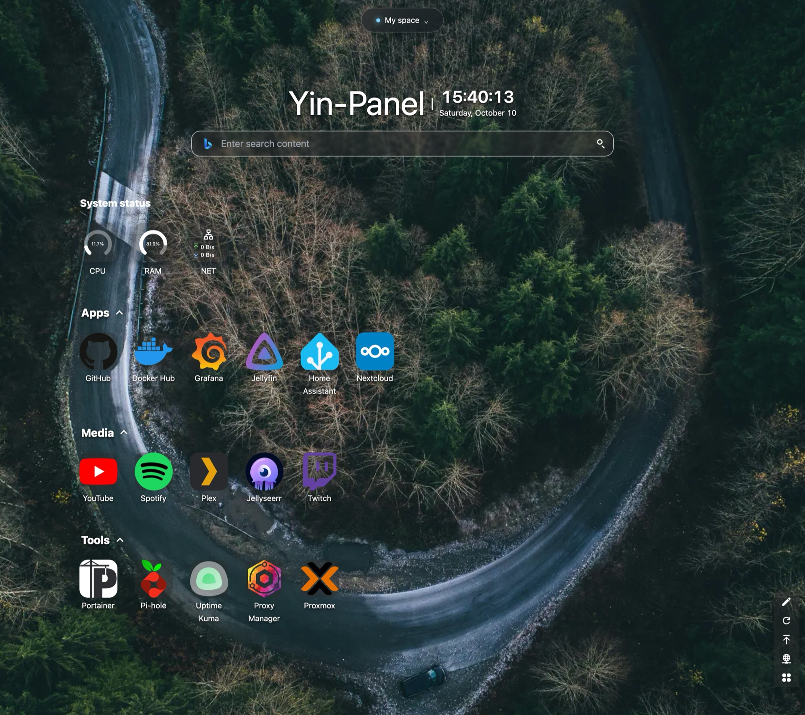
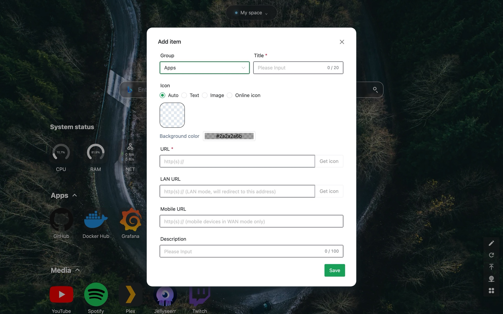
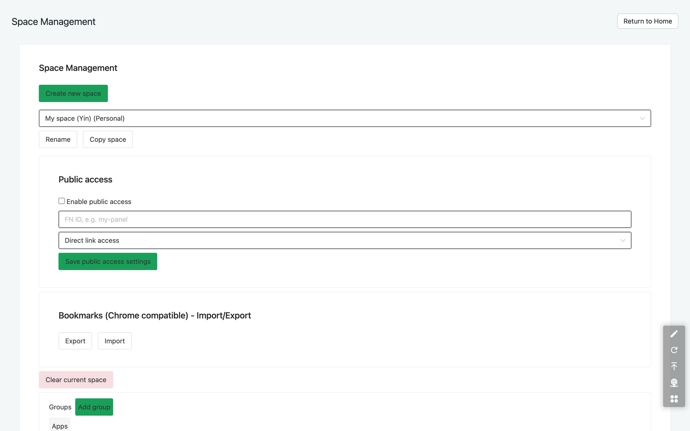

<div align="center">
    

<h1>Yin-Panel</h1>

[](https://github.com/yinorg/Yin-Panel/releases)
[](LICENSE)


**English** | [简体中文](README.zh-CN.md) | [繁體中文](README.zh-TW.md) | [日本語](README.ja-JP.md) | [한국어](README.ko-KR.md) | [Deutsch](README.de-DE.md) | [Français](README.fr-FR.md) | [Español](README.es-ES.md) | [Português (Brasil)](README.pt-BR.md) | [Русский](README.ru-RU.md)

</div>

Yin-Panel is a lightweight, self-hostable navigation panel for personal and shared spaces. It fits home networks, NAS devices, servers, and small organizations.

## Demo

<picture>
  <source media="(prefers-color-scheme: dark)" srcset="doc/images/readme-home-dark.jpg">
  
</picture>

| Item editor | Space management |
| --- | --- |
|  |  |

## Features

- Personal and shared spaces with isolated content
- Space creation, renaming, copying, and administrator transfer
- Group trees, bookmarks, icons, and sorting
- Bookmark import and export in the browser HTML format
- Space members with administrator, editor, and viewer roles
- OAuth 2.0 / OIDC login, account linking, and OIDC group authorization
- Email as the login identity, with an independent nickname
- Custom icons, installable theme packages, 10 UI languages, wallpapers, WAN/LAN and mobile URL modes, and in-page popup windows
- SQLite, MySQL, MariaDB, or PostgreSQL storage, Docker images for amd64 and arm64, and a Helm chart for Kubernetes

## Quick start

### Docker Compose

Requires Docker with the Compose plugin.

```bash
mkdir yin-panel && cd yin-panel
curl -LO https://raw.githubusercontent.com/yinorg/Yin-Panel/master/docker/docker-compose.yml
curl -o conf.yaml https://raw.githubusercontent.com/yinorg/Yin-Panel/master/backend/conf.yaml.example
mkdir -p database uploads
jwt_secret="$(openssl rand -hex 32)"
sed -i "s#^  secret: your_secret_key$#  secret: ${jwt_secret}#" conf.yaml
unset jwt_secret
YIN_PANEL_IMAGE=ghcr.io/yinorg/yin-panel-ce:0.6.0 docker compose up -d
```

Open <http://localhost:3002>.

Default administrator: `admin@yiniot.com`, password `admin@yiniot.com`. Change the password immediately after the first login, and set `base.root_url` and a unique `jwt.secret` in `conf.yaml`.

Every deployment should generate its own random `jwt.secret`. The repository ships only `conf.yaml.example`; the `conf.yaml` in your runtime directory holds instance secrets and OAuth credentials and must not be committed to Git.

### GHCR images

```bash
docker pull ghcr.io/yinorg/yin-panel-ce:0.6.0
docker pull ghcr.io/yinorg/yin-panel-ce:latest
```

`0.6.0` and `latest` are multi-architecture manifests for amd64 and arm64 hosts. Release tags never carry an architecture suffix; tags like `-amd64` or `-arm64` are not part of a release.

## Performance and recommended configuration

The numbers below come from local single-machine benchmarks (SQLite, empty database, loopback, load generator on the same host). Treat them as a sizing reference, not a production capacity promise. Real capacity depends mainly on the data volume per space, the write rate, and peak concurrency.

### Resource usage (measured magnitudes)

| Metric | Idle | 5000 req/s mixed load | Limit (tens of thousands of req/s) |
| --- | --- | --- | --- |
| Memory (RSS) | ~16 MB | ~105 MB | ~500 MB peak; falls back after the load stops |
| CPU | near zero | ~0.3 core | 2–3 cores |

- Memory stays around **105 MB** up to roughly **20k req/s** and does not grow linearly with load; the ~500 MB figure appears only under synthetic extreme pressure.
- A single core carries about **10k–12k req/s** (mixed read/write, small data set).
- Under a 5000 req/s mixed load: 0 failures, p95 about **0.25 ms**.

### Recommended configuration

| Scenario | CPU | Memory | Storage | Database |
| --- | --- | --- | --- | --- |
| Personal / home / NAS | 1 vCPU | 128–256 MB | SSD, 512 MB+ (plus headroom for icon uploads) | SQLite |
| Small team / shared spaces | 1–2 vCPU | 256–512 MB | SSD, 1–2 GB | SQLite |
| Organization / high concurrency | 2–4 vCPU | 1–2 GB | SSD | SQLite (single host) or MySQL (multiple instances, HA) |

### User scale reference

Assuming about 0.1 req/s per online user (mostly idle) and reserving peak headroom:

| Configuration | Theoretical average throughput | Idle concurrency (theoretical ceiling) | Suggested scale (with peak headroom) |
| --- | --- | --- | --- |
| 1 vCPU | ~10k req/s | ~100k | 20k–40k |
| 2 vCPU | ~20k req/s | ~200k | 50k–80k |
| 4 vCPU | ~40k req/s | ~400k | 100k+ |

The more active the users (editing, importing, refreshing frequently), the higher the request rate each user produces, and the lower the sustainable user count.

### Key factors that affect capacity

1. **Data volume** — list endpoints return every entry of a space in one response; more entries mean a costlier request. This is the part most worth measuring on your own data.
2. **Write rate** — SQLite allows only one writer at a time; write throughput is bound by disk fsync (on the order of hundreds of writes per second). For write-heavy or multi-instance setups, use MySQL.
3. **Peak, not average** — size for peaks, usually reserving 2–5× the average.
4. **Static assets** — let a reverse proxy or CDN serve `/assets/*` and other hashed assets; see "Cloudflare caching".

## Database

SQLite (default), MySQL, MariaDB, and PostgreSQL are supported.

- `base.database_drive`: `sqlite` (default) | `mysql` | `postgres`. **MariaDB uses `mysql`.**
- SQLite: `sqlite.file_path` (also see `read_pool_size`).
- MySQL / MariaDB: `mysql.{host,port,username,password,db_name,wait_timeout}`.
- PostgreSQL: `postgres.{host,port,username,password,db_name,ssl_mode,time_zone,wait_timeout}`.

SQLite-only capabilities (WAL, the read-only connection pool, and file-snapshot migration backups) apply to SQLite only; back up MySQL/MariaDB/PostgreSQL with their own tools.

### Migrating from SQLite to MySQL/MariaDB/PostgreSQL

```bash
# conf.yaml        — existing SQLite configuration
# conf.target.yaml — target configuration pointing at mysql or postgres (the target database must be empty)
./yin-panel migrate-db -source conf.yaml -target conf.target.yaml
```

The migration creates the complete schema in the target, copies every row while preserving primary keys (and resets identity sequences on PostgreSQL). It can be run repeatedly — each run replaces the target table contents. Afterwards, point `database_drive` in `conf.yaml` at the target.

## Configuration and OAuth/OIDC

`oauth` is the unified configuration entry for OAuth 2.0 and OpenID Connect (OIDC). The default template includes three verified examples: GitHub (OAuth 2.0), GitLab (standard OIDC), and Google (OAuth 2.0). The examples are all commented out by default; a provider is enabled only after you fill in real credentials and set `oauth.enable: true`. All configuration keys are documented in `backend/conf.yaml.example`.

A standard OIDC provider must support discovery, authorization code + PKCE, and JWKS signature validation, and must provide `email` and `email_verified` in the user information. Providers that meet these standards work in principle, but different vendors may still need extra field-mapping configuration.

OIDC callback URL:

```text
<base.root_url>/api/oauth/<provider>/callback
```

After the callback, the provider must return a verified email. The system identifies external identities by `provider + sub` and links local accounts by email.

## Spaces and permissions

Space permissions are keyed by an internal `UserID`, never by the email text. Changing an email therefore keeps existing space permissions, and the member list shows the latest email.

- Administrator: manages the space, members, roles, and OIDC rules
- Editor: maintains groups and bookmarks
- Viewer: read-only access

Creating a space, renaming it, adding groups, adding members, and adding OIDC rules all happen in dialogs.

## Helm

```bash
helm upgrade --install yin-panel ./distribution/helm-chart/yin-panel \
  --set image.tag=0.6.0
```

Before deploying, preview the rendered manifests with `helm template yin-panel ./distribution/helm-chart/yin-panel`.

## Source development

Requirements: Go `1.27.1`, Node.js `24.21.0`, npm or pnpm `9.15.5`.

```bash
cd frontend
npm ci
npm run build-only
```

Or with the pinned pnpm:

```bash
cd frontend
corepack pnpm install --frozen-lockfile
pnpm run build-only
```

```bash
cd backend
go test ./...
go build ./...
```

Full local update (frontend build, backend tests and build, deployment, restart) in one command:

```bash
./scripts/deploy-local.sh
```

The script uses the repository's `backend/` as the runtime directory by default and requires a local `conf.yaml` there; `YIN_PANEL_RUNTIME_DIR` in `.env.local` can override it. After all builds and tests pass, it stops only the Yin-Panel listener, uses `sudo` to replace the old binary and static files, and never touches the database, uploads, or configuration files.

The home-page theme system is documented in [`frontend/THEME_SYSTEM.md`](frontend/THEME_SYSTEM.md); scaffold a new theme with `npm run create:theme -- init "<name>"`. Full AI development, release, and restart conventions live in [AGENTS.md](./AGENTS.md).

## Backup and upgrade

Before upgrading, back up the database, `uploads/`, `conf.yaml`, and Helm values. Migrations preserve users, spaces, groups, bookmarks, and file references. If an upgrade goes wrong, restore the pre-upgrade backup; do not delete the database and start over.

## Cloudflare caching

If the domain uses Cloudflare's orange cloud, add Cache Rules that keep the entry document fresh and cache only hashed static assets for a long time.

Bypass cache: `/`, `/index.html`, `/login`, `/sw.js`, `/registerSW.js`, `/manifest.webmanifest`, and `/api/*`.

Long cache: `/assets/*` and `/workbox-*.js`. These files carry content-hashed names, and the origin serves them with 30-day `immutable` caching.

Do not enable `Cache Everything` for the whole site. After a release, purge only the entry document and service-worker files from the Cloudflare cache; hashed assets can stay on the edge.

## Open Core

The Yin-Panel Core edition is free and will continue to be maintained and updated. This repository is the only public source for the Core and publishes the `yin-panel-ce` image. The Enterprise edition lives in the private repository [yinorg/Yin-Panel-EE](https://github.com/yinorg/Yin-Panel-EE) and connects through public interfaces.

A running instance exposes its edition, capabilities, read-only state, and version at `GET /api/system/capabilities`. Report problems and suggestions in [GitHub Issues](https://github.com/yinorg/Yin-Panel/issues).

## Credits

Yin-Panel grew out of the open-source project [hslr-s/sun-panel](https://github.com/hslr-s/sun-panel); thanks to the original author for building the foundation.

Thanks as well to [PhantomMaa/sun-panel](https://github.com/PhantomMaa/sun-panel) for its optimizations and maintenance work. Yin-Panel took over continued maintenance from that base and keeps adding features, interaction improvements, and self-hosting-oriented changes.

Thanks to all original authors, contributors, and users.

## License

Yin-Panel is licensed under the [Business Source License 1.1](./LICENSE): production use is free for your personal use or for the internal business operations of your organization. Three years after the first publicly available distribution of each version, that version becomes available under the AGPL-3.0-or-later license.
